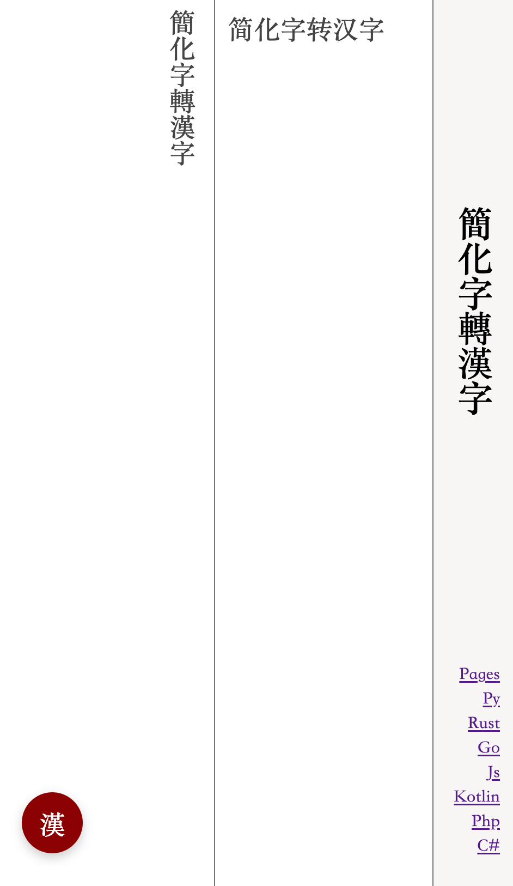

# 簡化字轉漢字

簡化字轉漢字，js實現

* 支持《通用規範漢字表》中的全部簡化字
* 對於一對多的簡化字，人工標註規則
* 支持運行時增加自定義規則
* 簡單快速

[doc](https://lizongying.github.io/js-han/)

[npm](https://www.npmjs.com/package/js-han)

[js](https://github.com/lizongying/js-han)

[python](https://github.com/lizongying/pyhan)

[rust](https://github.com/lizongying/rs-han)



## 使用

### node

install

```
npm i js-han@latest
```

package.json

```json
{
  "type": "module",
  "dependencies": {
    "js-han": "^0.0.6"
  }
}
```

example

```js
import Han from 'js-han'

const hanInstance = Han.getInstance()

// 蘿蔔
console.log(hanInstance.toTraditional('萝卜'))

// 胡卜
console.log(hanInstance.toTraditional('胡卜'))

// 胡蔔
hanInstance.addRule('卜,蔔,-1|0|胡')
console.log(hanInstance.toTraditional('胡卜'))

const han = new Han()

// 頭髮
console.log(han.toTraditional('头发'))
```

### browser

```html
<!DOCTYPE html>
<html lang="zh-Hans">
<head>
    <meta charset="UTF-8">
    <meta name="viewport" content="width=device-width, initial-scale=1.0">
    <title>簡化字轉漢字</title>
    <script type="module" src="https://lizongying.github.io/js-han/han.min.js"></script>
    <script type="module">
        const hanInstance = Han.getInstance();
        console.log(hanInstance.toTraditional('汉字'));
    </script>
</head>
<body>
</body>
</html>
```

## 讚賞

